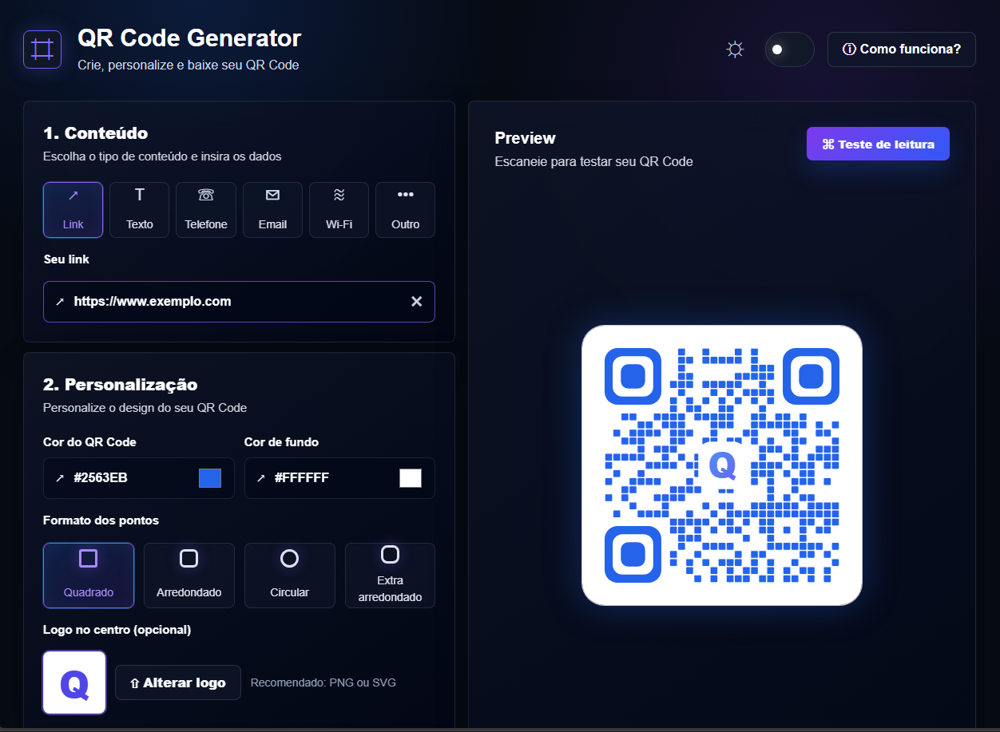

<div align="center">

# 📱 QR Code Generator

### Gere, personalize e exporte QR Codes diretamente pelo navegador

Crie QR Codes para links, textos, telefones, e-mails, Wi-Fi e outros conteúdos, personalize o visual em tempo real e exporte o resultado em PNG.

<br>

[](COLOQUE_AQUI_O_LINK_DO_PROJETO)

<br>


</div>

---

## 📖 Sobre o projeto

O **QR Code Generator** é uma aplicação web desenvolvida para criar e personalizar QR Codes de maneira rápida e visual.

O usuário pode escolher o tipo de conteúdo, alterar cores, tamanho, formato dos pontos, margem de leitura, nível de correção de erro e adicionar ou remover um logo central.

O preview é atualizado automaticamente a cada alteração, permitindo testar o resultado antes de realizar o download ou copiar a imagem.

A aplicação também conta com uma interface moderna e responsiva, com suporte aos temas **claro e escuro**.

---

## 🌐 Demonstração

A aplicação poderá ser acessada online em:

👉 **[Acessar QR Code Generator]https://qr-code-generator-delta-five.vercel.app/**

> Substitua `COLOQUE_AQUI_O_LINK_DO_PROJETO` pela URL do deploy.

---

## 📸 Preview



---

## ✨ Funcionalidades

### 📱 Tipos de conteúdo

O gerador suporta diferentes tipos de informação:

* 🔗 Links
* 📝 Textos
* 📞 Telefones
* ✉️ E-mails
* 📶 Redes Wi-Fi
* Outros conteúdos compatíveis

### 🎨 Personalização

O usuário pode alterar diferentes características do QR Code:

* Cor do código
* Cor de fundo
* Tamanho
* Margem de leitura
* Brilho
* Nível de correção de erro

### 🔲 Formato dos pontos

É possível alterar o estilo dos elementos que formam o QR Code:

* Quadrado
* Arredondado
* Circular
* Extra arredondado

### 🖼️ Logo central

O QR Code pode receber um logo ou imagem central para criar resultados mais personalizados.

O logo também pode ser removido quando não for necessário.

### ⚡ Preview em tempo real

Todas as alterações realizadas na interface são refletidas automaticamente no preview.

Isso permite experimentar diferentes combinações antes de exportar o resultado final.

### 🌓 Tema claro e escuro

A interface possui suporte aos dois modos de visualização:

* ☀️ Tema claro
* 🌙 Tema escuro

### ℹ️ Instruções de uso

A aplicação possui um modal explicativo com instruções para auxiliar no uso das ferramentas de personalização.

### 📥 Download

O QR Code gerado pode ser exportado em:

**PNG**

### 📋 Copiar QR Code

Também é possível copiar a imagem diretamente para a área de transferência para utilizá-la rapidamente em outros aplicativos.

---

## 🧠 Fluxo da aplicação

```text
Usuário
   │
   ▼
Seleciona o tipo de conteúdo
   │
   ├── Link
   ├── Texto
   ├── Telefone
   ├── E-mail
   └── Wi-Fi
   │
   ▼
Personalização
   │
   ├── Cor
   ├── Fundo
   ├── Tamanho
   ├── Formato dos pontos
   ├── Margem
   ├── Brilho
   ├── Correção de erro
   └── Logo
   │
   ▼
QR Code Generator
   │
   ▼
Preview em tempo real
   │
   ├── Copiar
   └── Download PNG
```

---

## 🛠️ Tecnologias

**React, TypeScript, Vite, Tailwind CSS, qrcode**

### Front-end

* React
* TypeScript
* Vite
* Tailwind CSS

### Geração de QR Code

* qrcode

---

## 🚀 Como executar localmente

### 1. Clone o repositório

```bash
git clone https://github.com/EmanuelFHX/QR-code-generator.git
```

### 2. Entre na pasta

```bash
cd QR-code-generator
```

### 3. Instale as dependências

```bash
npm install
```

### 4. Inicie o servidor de desenvolvimento

```bash
npm run dev
```

### 5. Acesse no navegador

```text
http://localhost:5173
```

---

## 📦 Build

Para gerar uma build de produção:

```bash
npm run build
```

Para executar a versão de produção:

```bash
npm start
```

---

## 🎯 Objetivo

O objetivo do **QR Code Generator** é oferecer uma ferramenta simples, bonita e funcional para criar QR Codes personalizados sem depender de plataformas externas.

O projeto busca combinar facilidade de uso com opções de personalização suficientes para criar códigos adequados para diferentes contextos, como websites, materiais impressos, cartões, redes Wi-Fi e projetos pessoais.

---

## 🎯 Objetivos técnicos

O projeto também permite trabalhar conceitos como:

* React
* TypeScript
* Componentização
* Gerenciamento de estado
* Atualização dinâmica da interface
* Manipulação de imagens
* Clipboard API
* Geração de arquivos
* Manipulação de QR Codes
* Customização visual
* Design responsivo
* Tema claro e escuro

---

## 🚀 Possíveis melhorias

* Exportação em SVG
* Exportação em PDF
* Histórico de QR Codes gerados
* Templates de estilo
* Paletas de cores pré-definidas
* Salvamento de configurações
* Compartilhamento por URL
* Download em múltiplas resoluções
* Geração de QR Codes em lote
* Leitor de QR Code integrado
* Transformação em PWA

---

## 📈 Status

O **QR Code Generator** está funcional e disponível para futuras melhorias e novas funcionalidades.

---

## 👨‍💻 Autor

**Emanuel Penna**

[](https://www.linkedin.com/in/emanuel-penna)

[](https://github.com/EmanuelFHX)

[](https://portfolio-emanuel-penna.vercel.app/)
